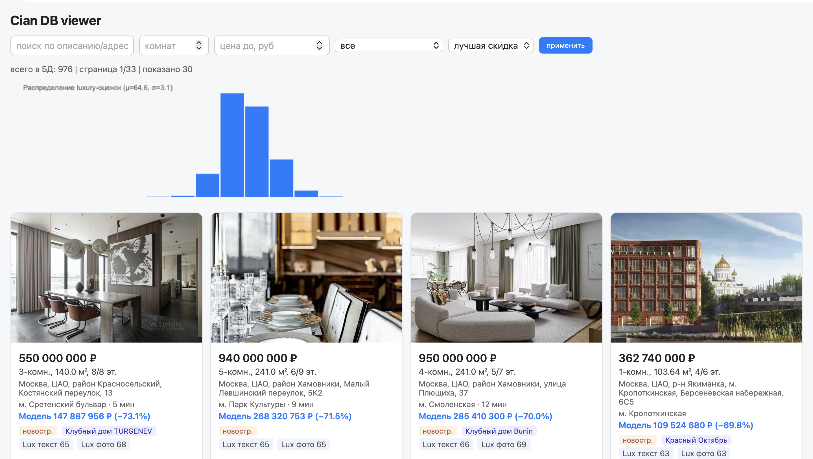
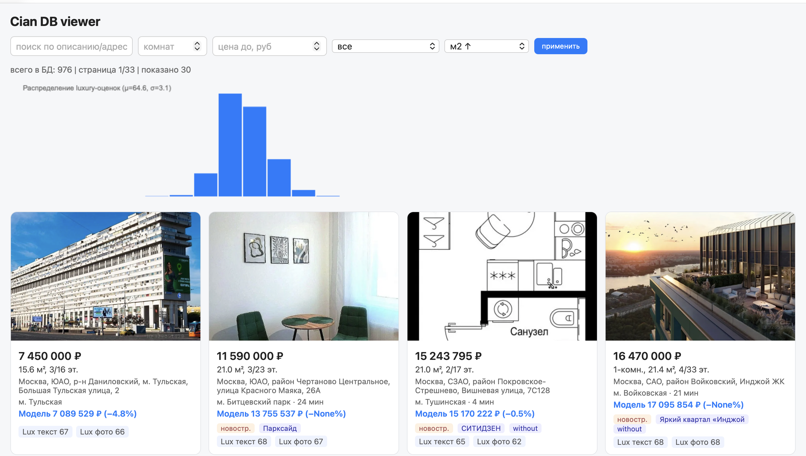
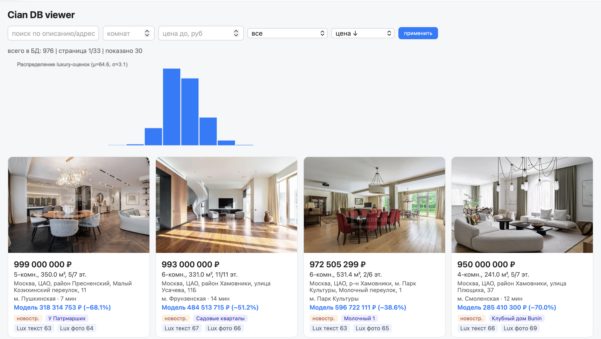

# Cian Real Estate Intelligence

End-to-end **ML-пайплайн** для аналитики недвижимости: Playwright ETL → PostgreSQL → **CatBoost** (оценка цены, MAPE ~30%) → **Mistral** luxury scoring → веб-viewer со скидкой относительно модели.

**Репо:** https://github.com/NeverLucky-DS/Cian

| Направление | Реализация |
|-------------|------------|
| ML | CatBoost регрессия, train/inference, сравнение с рыночной ценой |
| LLM | Mistral batch — luxury-скоринг текстов объявлений |
| Данные | PostgreSQL, SQLAlchemy, JSONB, Parquet export, DVC |
| ETL | Playwright-парсинг, async загрузка фото |
| Тесты | pytest — 15 тестов (`tests/`) |
| Web | Flask viewer: фильтры, карточки, гистограмма скорингов |

-------|------------|
| Python | CLI (`main.py`), парсер, ML-модули, viewer |
| PostgreSQL | SQLAlchemy 2.0, модели `Offer` / `OfferPhoto` / `ScrapeRun`, JSONB |
| Тесты | pytest — 15 тестов (`tests/`) |
| LLM / агенты | Mistral batch API — luxury-скоринг описаний |
| Async Python | `asyncio` + `httpx` + semaphore — параллельная загрузка фото |
| REST / Web | Flask viewer: список, фильтры, карточка, раздача фото |
| Docker | `docker compose up` — PostgreSQL 16 |
| Git | DVC-снапшоты данных, история в `changes/` |

> **FastAPI:** в текущей версии web-слой на Flask (SSR). REST JSON можно добавить поверх тех же SQLAlchemy-моделей — логичный следующий шаг.

---

## Демонстрация

### Каталог объявлений

Сетка карточек, фильтры, сортировка по лучшей скидке относительно CatBoost. Гистограмма luxury-оценок (μ, σ) на главной.



### Сортировка и фильтры

976 объявлений в БД, пагинация, сортировка по площади — видны mid-range лоты с предсказанием модели.



### Карточка объявления

Детальная страница: галерея фото, все поля из БД, сравнение цены с моделью, luxury-баллы от Mistral.



---

## Быстрый старт

```bash
# 1. PostgreSQL
docker compose up -d

# 2. Зависимости
uv sync

# 3. Env
cp .env.example .env

# 4. Данные (DVC) + восстановление БД
uv run dvc pull
gunzip -c data/cian.sql.gz | docker exec -i cian-pg psql -U cian -d cian

# 5. Viewer
uv run python viewer.py
# → http://127.0.0.1:5005
```

Полный парсинг с нуля: `uv run playwright install chromium` → `uv run python main.py pipeline --pages 2 --headless`.

Для luxury-скоринга: `export MISTRAL_API_KEY=...` и `uv run python main.py luxury-process`.

---

## Архитектура

```
Cian.ru (JSON + Playwright)
        ↓  listing / offers / photos
   PostgreSQL (offers, photos, scrape_runs)
        ↓  export
   Parquet warehouse → CatBoost (цена) + Mistral (luxury)
        ↓
   Flask viewer (фильтры, скидки, график luxury)
```

**Структура:** `parser/` — ETL, `db/` — ORM, `ml/` — CatBoost + Mistral, `data/` — экспорт, `viewer.py` — UI.

---

## Тесты

```bash
uv sync --dev
uv run pytest -v
```

Покрыто: парсинг JSON → row mapping, luxury-промпт, Mistral client (mock httpx), расчёт скидки viewer. Без внешних API и без живой БД.

---

## CLI (основные команды)

| Команда | Назначение |
|---------|------------|
| `init-db` | Создать таблицы |
| `pipeline --pages N` | Полный прогон парсера |
| `export` | Postgres → Parquet/CSV |
| `catboost-train` / `catboost-predict` | Обучение и inference |
| `luxury-process` | Batch luxury через Mistral |
